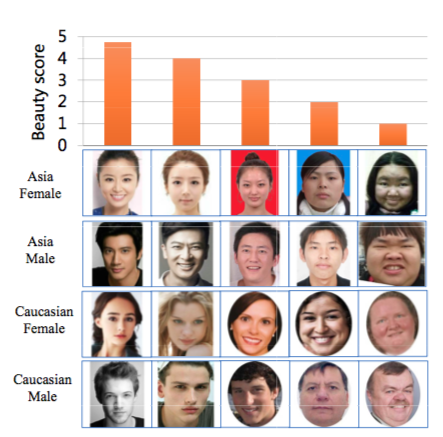

# BeautyPredict

Facial beauty prediction via deep learning methods based on SCUT-FBP5500 dataset described in the paper [1] and [2]，which listed at the end of this article, have been partially implemented in this project.

The SCUT- FBP5500 dataset has totally 5500 frontal faces with diverse properties (male/female, Asian/Caucasian, ages) and diverse labels (face landmarks, beauty scores within [1, 5], beauty score distribution), which allows different computational models with different FBP paradigms.

Further more, three recently proposed CNN models with different structures for FBP, including AlexNet, ResNet-18 and ResNeXt-50, which are trained by initializing weights using networks pre-trained on the ImageNet dataset, have been evaluated on the dataset.

The results illustrates that the deepest CNN-based ResNeXt-50 model obtains the best performance. [The Pearson correlation coefficient](https://en.wikipedia.org/wiki/Pearson_correlation_coefficient) is 0.8997.

The second paper, recasts facial attractiveness computation as a label distribution learning problem and puts forward an end-to-end attractiveness learning framework. Extensive experiments are conducted on a standard benchmark, the SCUT-FBP dataset, where shows significant advantages over other state-of-the-art work.

I have trained a five layers CNN model and a Label distribution learning model based on ResNet fine-tuing. The Pearson correlation coefficient is 0.8 and 0.91 respectively, which is tested on the SCUT-FBP5500 dataset.

## Demo

## Dependency
1. Python 3.x
2. Tensorflow
3. Keras
4. numpy
5. opencv
6. h5py

## How to use
1. The trained model files could be downloaded via follow links:
- [five layers CNN model](https://pan.baidu.com/s/1f3MdTGFm59QEhBDvM8Vj0Q)
- [Label distribution learning model](https://pan.baidu.com/s/1_u2iBGAvqP1YvKVR5kRPyA)

2. put five layers CNN model under inference/cnn_5 folder, and run beauty_predict.py

3. put Label distribution learning model under inference/ldl+resnet folder, and run beauty_predict.py

-----

If you want to train your own model, read the follow part.

## How to train
1. Prepare Data
- download [dataset](https://pan.baidu.com/s/1-mBxJgaDwgy02th9S0olMA), unzip and put it under Project Root folder
- cd train/cnn_5 and run prepare_data.py to prepare data before training 5 layers cnn model
- cd train/ldl+resnet and run prepare_data.py to prepare data before training label distribution learning model

2. Train

3. Predict

## References
1. [SCUT-FBP5500 A Diverse Benchmark Dataset for Multi-Paradigm Facial Beauty Prediction](https://arxiv.org/abs/1801.06345)
2. [Label Distribution Based Facial Attractiveness Computation by Deep Residual Learning](https://arxiv.org/abs/1609.00496)